# python_labs_2026
## Лабораторная №1 — тема **Недвижимость**

---

#  1. Описание и разработка класса

Реализован класс `Property`, 
который описывает **один объект недвижимости**.

---

##  Назначение

Класс представляет отдельную сущность — объект недвижимости,  
который может быть:

- выставлен на продажу  
- сдан в аренду  
- деактивирован (например, снят с публикации)

---

##  Атрибуты класса
Класс содержит следующие поля:

- `_price` — цена объекта  
- `_area` — площадь  
- `_adress` — адрес (улица + номер дома)  
- `_for_rent` — флаг аренды (True / False)  
- `_rent_terms` — срок аренды (если применимо)  
- `_is_active` — статус активности объекта  

---

##  Логика и ограничения

- если объект сдаётся - обязательно есть срок аренды  
- если объект продаётся - срока аренды быть не должно  
- цена и площадь должны быть положительными и соотв. минимуму определенных стандартов
- адрес должен быть корректным  

---

##  Методы класса

###  Мета-методы

#### `__str__`
Возвращает удобное для пользователя текстовое описание объекта.

#### `__repr__`
Возвращает техническое представление объекта для разработчика.

#### `__eq__`
Сравнивает два объекта по всем атрибутам.

---

###  Свойства (@property)

Используются для безопасного доступа к данным:

- `price`
- `area`
- `adress`
- `is_active`

Также реализован **setter для price** с проверкой:

- нельзя менять цену у неактивного объекта  
- новая цена проходит валидацию  

---

### 🔹 Бизнес-методы

#### `activate()` / `deactivate()`
Изменяют состояние объекта (активен / неактивен)

#### `tax_price(tax)`
Вычисляет цену с учётом налога.

---

##  Валидация

Вся проверка вынесена в отдельный файл `validate.py`, чтобы избежать дублирования

Реализованы проверки:

- типов данных  
- диапазонов значений  
- пустых значений  
- логических зависимостей  

---

# 2. Демонстрация и проверки

##  Проверка валидации

### Проверка типов данных
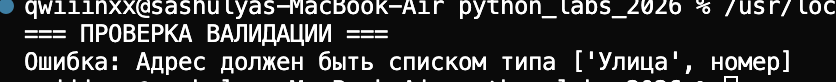

---

### Проверка диапазонов
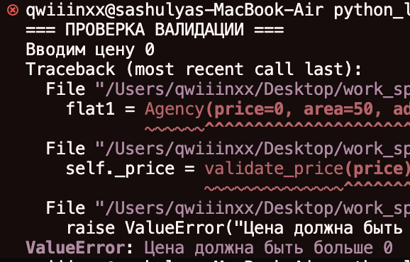

---

### Проверка на пустоту
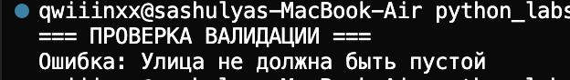

---

### Проверка логических зависимостей
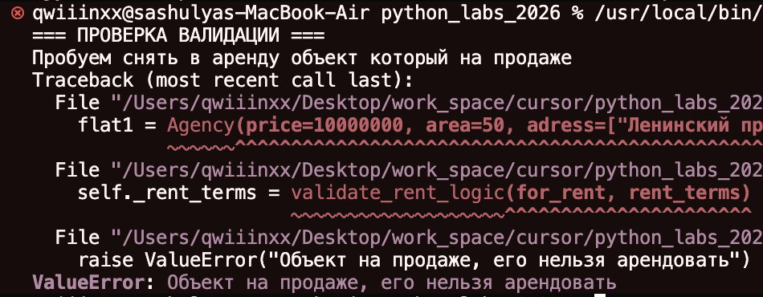

---

##  Проверка мета-методов

### `__str__`
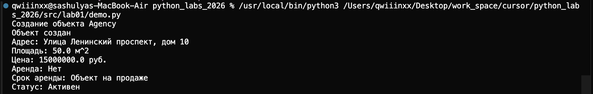

---

### `__repr__`
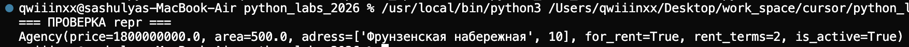

---

### `__eq__`

#### Неравные объекты
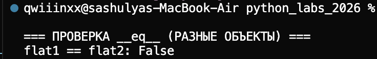

#### Равные объекты
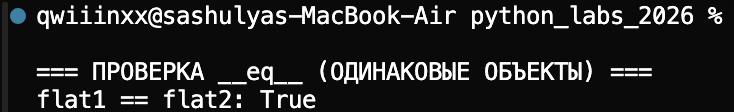

---

## Проверка бизнес-методов

### deactivate / activate
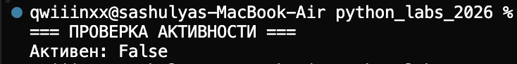
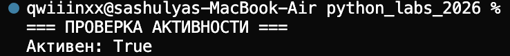

---

### tax_price
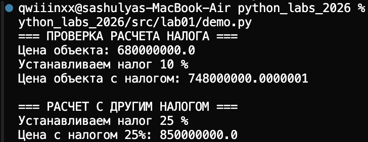

---

##  Проверка свойств

Доступ к данным через @property:
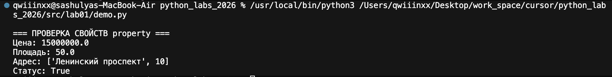

---

Изменение цены:

```python
flat1.price = 10000000
