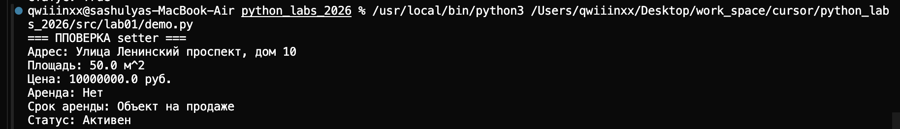
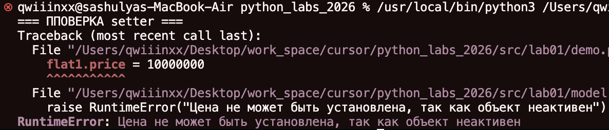

# python_labs_2026
## Лабораторная № 1 -> тема **Недвижимость**
## *Что реализованно?*
# 1) **Класс Agency**
### `model.py`
### Агенство недвижимости, которое предоставяляет объекты для снятия в аренду или покупки, отображает свойства каждого объекта, его параметры
---
Параметры:
- цена
- площадь
- адресс
- для продажи / для аренды
- срок аренды (если объект на аренде)
- активна / неактивна


---
# 2) Валидация в отдельном файле 
### `validate.py`
- проверка на тип данных


- проверка на диапазон (не может быть отриц. или меньше стандартов)


- проверка на пустоту


- проверка на логические цепочки (например, если объект можно только купить, значит у него не должно быть срока аренды)

--- 
# 3) Мета-методы
- `__str__`: выводит красивую сводку для каждого объекта по всем параметрам

- `__repr__`: удобный вывод для разработчика, также вся информация об объекте
- `__eq__`: метод для сравнения объектов по параметрам, объекты равны, если все параметры равны
---
# 4) Бизнес-методы
- `set_active()`: можно сделать объект неактивным, если его сняли с продажи, или вернуть активность. Изначально все объекты активны
###### 1. `flat1.deactivate()`

###### 2. `flat1.activate()`

- `tax_price()`: можно расчитать цену объекта с учетом налога.

---
# 5) Декоратор @property
### Позволяет удобно обращаться к свойствам объекта


## Проверка setter
#### Цена была 15.000.000 меняем на -> 10.000.000
`flat1.price = 10000000`


#### Пробуем менять цену у неактивного объекта
```python
flat1.deactivate()
flat1.price = 10000000
```



